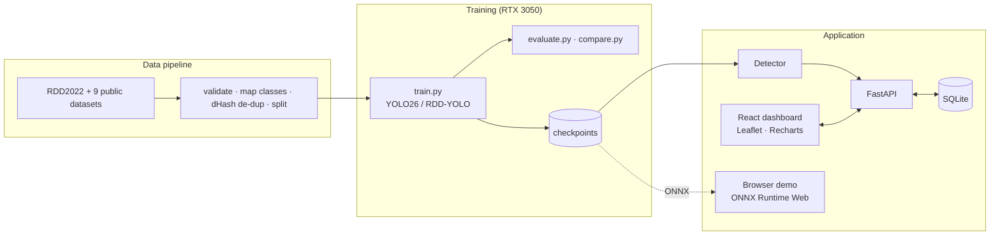

<div align="center">

# 🛣️ RDD-YOLO

### AI-Based Road Damage Detection, Geolocation and Mapping System

Detects **longitudinal cracks, transverse cracks, alligator cracks and potholes** in road images and videos,
attaches real GPS locations, and maps every detection on OpenStreetMap — trained end-to-end on RDD2022 and
9 more public datasets with a fully reproducible pipeline.

[](https://ethical0101.github.io/RDD-YOLO/)

[](docs/experiments.md)
[](https://docs.ultralytics.com/)
[](https://github.com/ultralytics/ultralytics)
[](https://pytorch.org/)
[](https://fastapi.tiangolo.com/)
[](https://react.dev/)
[](https://onnxruntime.ai/)
[](https://www.openstreetmap.org/)
[](tests/)
[](LICENSE)
[](#-technology-stack)

**[Live demo](https://ethical0101.github.io/RDD-YOLO/)** ·
**[Results](docs/experiments.md)** ·
**[Datasets](docs/datasets.md)** ·
**[Architecture](docs/architecture.md)** ·
**[Training](docs/training.md)** ·
**[API](docs/api.md)**

</div>

---

## 📌 Overview

RDD-YOLO is a complete deep-learning system for automated road inspection, built as a university Deep Learning
project around the paper *RDD-YOLO: Road Damage Detection Algorithm Based on Improved YOLOv8* (Li et al., 2024).

* **Real training, real numbers.** Five experiments were trained on an RTX 3050 (4 GB). Every metric in this
  repository is produced by scripts from held-out test data — nothing is typed in by hand.
* **Research component.** The paper's three modifications (SimAM attention, GhostConv neck, bilinear upsampling)
  are implemented on the current Ultralytics YOLO26 and compared against an identical baseline.
* **End-to-end product.** FastAPI backend, React dashboard, image / video / live-camera detection, honest
  geolocation (browser GPS, EXIF, manual, video GPS route), OpenStreetMap damage map, analytics and history.
* **Zero cost.** Free and open-source stack, no API keys; the live demo runs the model in your browser.

> **Which model?** The original report uses YOLOv8. This implementation uses **Ultralytics 8.4.174 / YOLO26**,
> the current Ultralytics family (Oct 2026). The served model is **YOLO26s** (Experiment E).

## 🌐 Live demo

**https://ethical0101.github.io/RDD-YOLO/** — no installation, works in Chrome / Edge / Firefox.

The trained YOLO26s model (ONNX, 38 MB) runs **entirely in your browser** with ONNX Runtime Web (WebGPU, or
WebAssembly fallback). Click a sample road photo, or upload your own, then open the map. Images and detections
never leave your browser (stored in IndexedDB). For GPU speed and the Python backend, run the project locally.

| | Browser demo | Local app |
|---|---|---|
| Inference | your browser (WebGPU / WASM), ~0.15–1 s per image | PyTorch on CUDA, ~15 ms per image |
| Storage | IndexedDB in your browser | SQLite (PostgreSQL-ready) |
| Video | analysed in the browser, boxes overlaid on playback | re-encoded H.264 with boxes |
| Model switching / training data | served model only | all checkpoints, full pipeline |

## 📊 Results

Measured on held-out test sets (no test image is ever used for training; see [leakage control](docs/datasets.md#leakage-control)).

### Served model — Experiment E (YOLO26s), original RDD2022 test split (2,023 images)

| Metric | Value |
|---|---|
| **mAP@50** | **62.45 %** |
| mAP@50-95 | 32.36 % |
| Precision | 64.22 % |
| Recall | 57.75 % |
| F1 | 60.81 % |
| Per class mAP@50 | D00 70.0 % · D10 61.6 % · D20 66.4 % · D40 51.8 % |
| Size / speed | 9.95 M params · 19.4 MB · 71 FPS (RTX 3050, batch 1) |

### All experiments (mAP@50)

| Test set | A Baseline YOLO26n | B RDD-YOLO26n | C + data | D + close-up | **E YOLO26s** |
|---|---|---|---|---|---|
| Original RDD2022 test (2,023) | 59.66 % | 59.46 % | 60.50 % | 61.02 % | **62.45 %** |
| Norway + China Drone (532) | – | 12.92 % | 33.37 % | 33.71 % | **40.85 %** |
| Ground-level potholes (221) | – | 18.34 % | 44.61 % | 55.56 % | **58.83 %** |
| Close-up potholes (235) | – | 21.41 % | 38.06 % | 63.88 % | **67.17 %** |
| Pavement-distress sources (1,803) | – | – | – | 22.96 % | **58.96 %** |

* **A vs B (paper replication):** the RDD-YOLO modifications matched the baseline's accuracy (differences < 0.3 pp)
  with 3.6 % fewer parameters but 8 % lower FPS at nano scale / 40 epochs — the paper's gains (YOLOv8x, 180 epochs)
  were not reproduced in this setting, and this is reported as measured.
* **C → E:** more (de-duplicated, licensed) data, then a larger model, improved every test set.
* For context: the RDD-YOLO paper reports 62.5 % mAP@50 with YOLOv8x on an RTX 4090; setups differ, so numbers
  are not directly comparable.

Full tables, per-class results, training times and caveats: **[docs/experiments.md](docs/experiments.md)**.

## ✨ Features

| Area | What you get |
|---|---|
| 🧠 Detection | 4 RDD2022 classes, bounding boxes, confidence, explainable severity (LOW / MEDIUM / HIGH) |
| 🖼️ Image | drag-and-drop JPEG / PNG / WebP / AVIF / HEIC, EXIF orientation handled |
| 🎞️ Video | frame-stride analysis, annotated H.264 output, timestamped & de-duplicated detections, click-to-seek timeline |
| 📷 Live camera | webcam / phone camera detection, snapshots with GPS |
| 📍 Geolocation | **Browser GPS**, **EXIF GPS** (auto), **Manual** (type or click the map), **Route** (CSV/GPX interpolation per video timestamp) — every record labelled with its source; nothing is ever invented |
| 🗺️ Map | OpenStreetMap + Leaflet, clustering, heatmap, filters (class, severity, confidence, source, time), popups with crops |
| 📈 Analytics | class distribution, confidence histogram, severity by class, detections over time |
| 🗂️ History | filter, sort, paginate, CSV export, delete, jump to map |
| 🔬 Model & training | live metrics, loss / mAP curves, confusion matrices, PR curves, experiment comparison |
| ⚙️ Ops | one-command setup / training / evaluation / startup scripts, 40 automated tests, Docker files |

## 🏗️ Architecture



Details, data model and request flows: [docs/architecture.md](docs/architecture.md).

## 🚀 Quick start (local, Windows)

Requirements: Windows 10/11, Python 3.11+ (3.13 tested), Node.js 20.19+, Git; NVIDIA GPU optional (CPU works).

```powershell
git clone https://github.com/ethical0101/RDD-YOLO.git
cd RDD-YOLO
powershell -ExecutionPolicy Bypass -File scripts\setup.ps1     # venv, PyTorch (CUDA or CPU), deps, npm install
powershell -ExecutionPolicy Bypass -File scripts\start_all.ps1 # builds the dashboard and opens http://localhost:8000
```

The trained checkpoints are included in `models/weights/`, so detection works immediately — no training needed.
Try the held-out sample photos in [`demo_images/`](demo_images/).

## 🔁 Reproduce the training

```powershell
scripts\prepare_data.ps1                    # download + validate RDD2022 (5 countries, ~2.4 GB)
scripts\train.ps1                           # Experiments A + B (40 epochs each) + evaluation + comparison
scripts\train_extended.ps1                  # Experiment C (all RDD2022 regions + pothole sets)
.venv\Scripts\python dataset\build_extended_v2.py   # Experiment D data (close-up potholes, de-duplicated)
bash scripts/run_experiment_e.sh            # Experiment E (YOLO26s on extended data v3)
scripts\evaluate.ps1                        # re-evaluate on the test split
```

Hardware is detected automatically (CUDA, GPU, VRAM, CPU, RAM) and batch size / workers / AMP / model scale are
chosen accordingly. Runs are resumable. See [docs/training.md](docs/training.md).

## 🧰 Technology stack

| Layer | Technology (versions verified Oct 2026) |
|---|---|
| Deep learning | PyTorch 2.14.1 (CUDA 13.0), Ultralytics 8.4.174 (YOLO26), OpenCV 5.0 |
| Backend | FastAPI 0.142, Uvicorn, SQLAlchemy 2.1 (SQLite, PostgreSQL-ready), Pydantic Settings |
| Frontend | React 19, Vite 8, TypeScript, Tailwind CSS 4, React-Leaflet 5, Leaflet.markercluster, Leaflet.heat, Recharts 3 |
| Browser inference | ONNX Runtime Web 1.30 (WebGPU / WASM), exifr, IndexedDB |
| Maps | OpenStreetMap tiles (free, attribution shown) |
| Hosting | GitHub Pages (live demo) |

No paid APIs, no API keys, no paid cloud.

## 📁 Project structure

```
RDD-YOLO/
├── rdd_yolo/              core library: detector, SimAM, severity, geolocation, hardware, image I/O
├── backend/app/           FastAPI app (api/, services/, db/, core/)
├── frontend/              React + TypeScript dashboard (also builds the browser demo)
├── dataset/               download + validation + dataset builders (raw/ and processed/ are generated)
├── training/              train.py, evaluate.py, compare.py
├── inference/             command-line inference
├── models/
│   ├── architectures/     yolo26-baseline.yaml, yolo26-rdd.yaml
│   └── weights/           trained checkpoints (A, B, C, D, E)
├── experiments/           metrics, curves, confusion matrices of every run
├── demo_images/           held-out RDD2022 test photos for demos
├── scripts/               setup / data / train / evaluate / start / deploy automation
├── tests/                 40 pytest tests
└── docs/                  architecture, training, experiments, datasets, API
```

## 🔌 API

Interactive docs at `http://127.0.0.1:8000/docs` when running locally. Main endpoints:

| Method | Endpoint | Purpose |
|---|---|---|
| POST | `/api/inference/image` | detect on an image (+ optional location) |
| POST | `/api/inference/video` | background video job (+ optional GPS route) |
| POST | `/api/inference/frame` | webcam frame / snapshot |
| GET | `/api/detections` | filtered, paginated history |
| GET | `/api/map/detections` | GeoJSON for the map |
| GET | `/api/stats` | analytics aggregates |
| GET | `/api/model`, `/api/training/*` | model info, real training results |

Full reference: [docs/api.md](docs/api.md).

## 📐 Severity estimate

```
score = 100 × (0.45·class_weight + 0.40·min(1, √(box_area / image_area / 0.25)) + 0.15·confidence)
        + min(15, 5 × same-class detections stored within 15 m)
class_weight: D00 0.45 · D10 0.50 · D20 0.80 · D40 1.00       LOW < 40 ≤ MEDIUM < 65 ≤ HIGH
```

A transparent heuristic for prioritising inspection — **not** an engineering-certified pavement condition rating.

## 🧪 Tests

```powershell
scripts\run_tests.ps1     # 40 pytest tests (core, dataset prep, architectures, inference, DB, API, persistence) + frontend build
```

## ☁️ Deployment

**Live demo (free, GitHub Pages)** — rebuild and publish with one command:

```powershell
.venv\Scripts\python scripts\deploy_github_pages.py
```

It exports the served model to ONNX, builds the dashboard in browser mode, snapshots the real training results
and pushes to the `gh-pages` branch.

**Full stack in a container** — `docker-compose.yml` and `scripts/build_hf_space.py` package the FastAPI app.
Note: Hugging Face now requires a PRO plan for Docker Spaces, and the Docker images were not built in the
development environment; the native Windows workflow is the tested path.

## 🎓 Demonstration workflow

1. `scripts\start_all.ps1` (or open the live demo).
2. **Model** page → trained model, dataset, classes, test metrics.
3. **Image Detection** → sample photo → boxes, confidence, severity.
4. **Use my location** / click the map → **View on map** → marker popup.
5. **Analytics** and **Detection History** → the new records.
6. **Training & Experiments** → curves, confusion matrices, baseline vs RDD-YOLO, Experiments C–E.
7. Optional: **Video Detection** with a GPS route, **Live Camera**.

## ⚠️ Limitations

* The official RDD2022 test set has no public labels; the "original test split" is a fixed held-out 10 % of the labelled data.
* Results differ from the RDD-YOLO paper (different model scale, data and hardware) and are reported only for this setup.
* Ground-level close-ups remain harder than vehicle-camera views (see the per-test-set results).
* Severity is a heuristic. Free browser demo speed depends on the visitor's hardware.

## 🤝 Acknowledgements & citation

* Y. Li, C. Yin, Y. Lei, J. Zhang, Y. Yan, "RDD-YOLO: Road Damage Detection Algorithm Based on Improved You Only Look Once Version 8," *Applied Sciences* 14(8):3360, 2024.
* D. Arya et al., "RDD2022: A multi-national image dataset for automatic road damage detection," *Geoscience Data Journal*, 2024.
* L. Yang et al., "SimAM: A Simple, Parameter-Free Attention Module for CNNs," ICML 2021 · K. Han et al., "GhostNet," CVPR 2020.
* [Ultralytics YOLO](https://github.com/ultralytics/ultralytics) (AGPL-3.0) · [ONNX Runtime](https://onnxruntime.ai/) · [OpenStreetMap](https://www.openstreetmap.org/copyright) contributors.
* All training datasets and their licenses: [docs/datasets.md](docs/datasets.md).

## 📄 License

Released under the [GNU AGPL-3.0](LICENSE), matching the license of the Ultralytics YOLO framework it builds on.
Datasets keep their own licenses (CC BY 4.0, MIT, Apache-2.0) — see [docs/datasets.md](docs/datasets.md).
