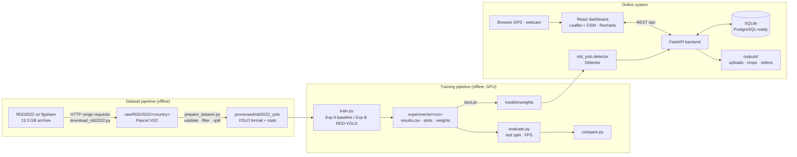
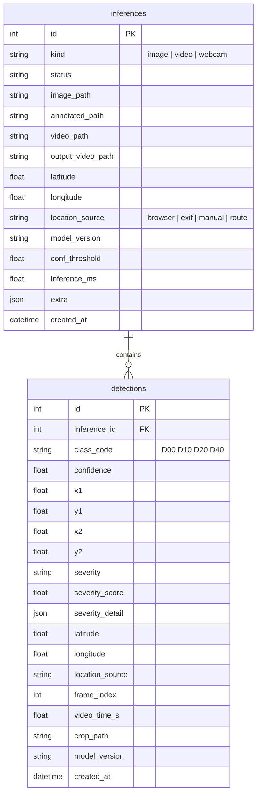

# System architecture

## Overview

## Components

| Layer | Location | Responsibility |
|---|---|---|
| Core library | `rdd_yolo/` | Class schema, hardware detection, SimAM module, inference engine, severity heuristic, geolocation (EXIF, routes). Shared by training, CLI and backend. |
| Dataset | `dataset/` | Selective download of the official RDD2022 archive; validation and VOC→YOLO conversion; statistics. |
| Architectures | `models/architectures/` | `yolo26-baseline.yaml` (unmodified YOLO26) and `yolo26-rdd.yaml` (SimAM + bilinear + GhostConv). |
| Training | `training/` | `train.py`, `evaluate.py`, `compare.py`; orchestration in `scripts/run_experiments.py`. |
| CLI inference | `inference/predict.py` | Images / folders / videos without the database. |
| Backend | `backend/app/` | FastAPI app: `api/routes.py` (REST), `services/` (model, inference, storage, queries, training artefacts), `db/` (SQLAlchemy models). |
| Frontend | `frontend/` | React 19 + Vite + TypeScript + Tailwind 4, React-Leaflet (OpenStreetMap), Leaflet.markercluster, Leaflet.heat, Recharts. |
| Tests | `tests/` | pytest: core logic, dataset prep, architectures, inference, DB, API end-to-end. |

## Request flow: image detection

1. The dashboard posts `multipart/form-data` to `POST /api/inference/image` (image, confidence, optional lat/lon + source).
2. `resolve_location` chooses the location: **EXIF GPS** embedded in the photo wins (if present), else the
   browser/manual coordinates sent by the client, else **no location** (nothing is guessed).
3. `Detector.predict` runs the checkpoint (CUDA if available, CPU otherwise), producing boxes, classes and confidences.
4. For each box the severity heuristic (`rdd_yolo/severity.py`) is computed; the repeat-report term queries the
   database for same-class detections within 15 m.
5. The original image, annotated image and per-detection crops are written to `outputs/`; one `inferences` row
   and N `detections` rows are committed.
6. The JSON response drives the UI (SVG box overlay, table, map link).

## Video flow

`POST /api/inference/video` stores the upload, creates an `inferences` row (`status=queued`) and starts a
background thread. The worker decodes frames with OpenCV, runs the detector on every *stride*-th frame,
encodes an annotated H.264 MP4 through the ffmpeg binary bundled with `imageio-ffmpeg` (playable in browsers),
merges repeated sightings of the same defect (same class, IoU ≥ 0.3, gap ≤ 1 s) into one record, and — if a
GPS route (CSV/GPX) was uploaded — interpolates a position for each detection's timestamp. The UI polls
`GET /api/inference/video/{id}` for progress.

## Data model

Only portable SQLAlchemy types (`Integer`, `Float`, `String`, `Text`, `DateTime(timezone=True)`, `JSON`) are used,
so switching to PostgreSQL is a matter of setting `RDD_DATABASE_URL=postgresql+psycopg://…` and installing
`psycopg`. File paths are stored relative to `outputs/`. Timestamps are stored in UTC.

## Why these choices

* **YOLO26n (Ultralytics 8.4.174)** — the current Ultralytics detector family at development time (Oct 2026).
  The nano scale trains at batch 16 within ~2.5 GB VRAM on the RTX 3050 4 GB at ~210 s/epoch on 16k images.
* **SQLite** — zero-config, file-based, free; adequate for a single-node demo.
* **OpenStreetMap + Leaflet** — no API key, no billing.
* **Single process deployment** — the backend also serves the built dashboard (`frontend/dist`), so the demo
  needs one command and one port.
