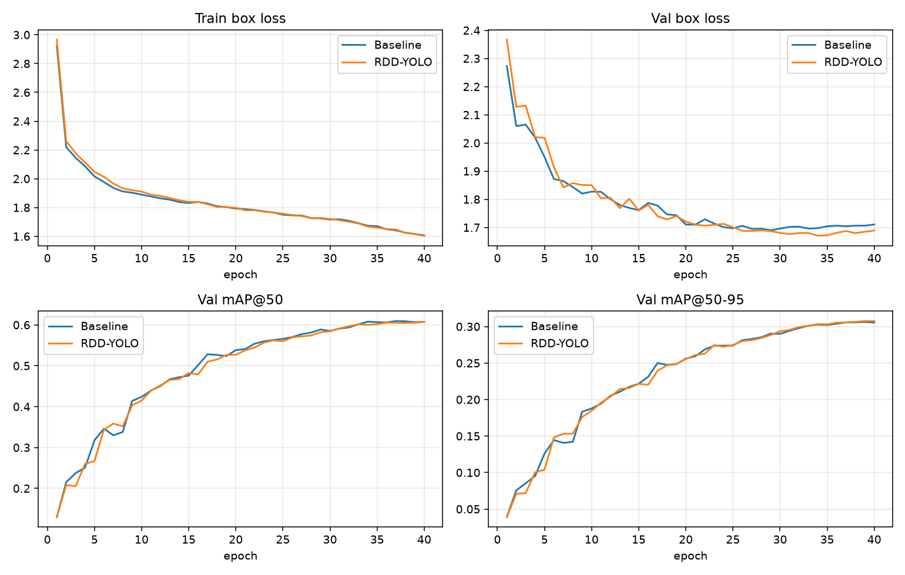
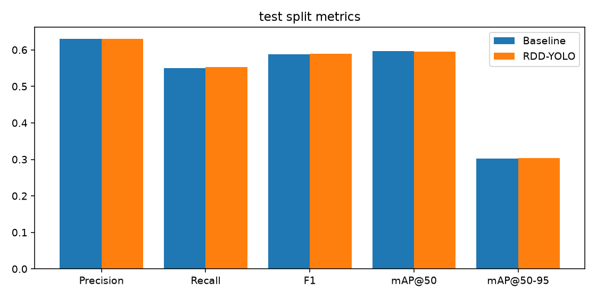

# Experiments: baseline YOLO26n vs RDD-YOLO26n

> Auto-generated by `scripts/write_experiments_doc.py` from the files in `experiments/`.
> Do not edit numbers by hand; re-run the script after re-training.

## Setup

| | Experiment A — Baseline | Experiment B — RDD-YOLO |
|---|---|---|
| Architecture | `models/architectures/yolo26-baseline.yaml` (unmodified YOLO26) | `models/architectures/yolo26-rdd.yaml` |
| Modifications | — | SimAM after backbone · bilinear (align_corners) upsampling ×2 · GhostConv for both PAN downsampling convs |
| Epochs completed | 40 / 40 | 40 / 40 |
| Training time | 2.31 h wall (NVIDIA GeForce RTX 3050 Laptop GPU); median epoch 199 s | 9.30 h wall (NVIDIA GeForce RTX 3050 Laptop GPU); median epoch 348 s; epoch 29 took 19,770 s - an idle gap of ≈5.4 h, most likely the laptop sleeping; no checkpoints were written during it |
| Best epoch (val fitness) | 39 | 40 |

Common settings: RDD2022 subset (Japan, India, Czech, United States, China-MotorBike), 16,156 train / 2,017 val / 2,023 test images, 640 px, batch 16, AMP, seed 0, deterministic, optimizer `auto` (MuSGD), mosaic off for the last 10 epochs, early-stopping patience 15. Both start from the same initialisation: COCO-pretrained YOLO26n backbone (layers 0–10), neck and head trained from scratch.

## Test-split results (2,023 held-out images)

| Metric (%) | Baseline | RDD-YOLO | Δ (pp) |
|---|---|---|---|
| Precision | 63.09 | 63.08 | -0.00 |
| Recall | 55.05 | 55.28 | +0.22 |
| F1 | 58.80 | 58.92 | +0.12 |
| mAP@50 | 59.66 | 59.46 | -0.20 |
| mAP@50-95 | 30.24 | 30.30 | +0.07 |
| Parameters | 2,505,360 | 2,415,600 | -89,760 |
| GFLOPs (640) | 5.9 | 5.81 | |
| Checkpoint size (MB) | 5.14 | 4.97 | |
| Inference latency (ms, batch 1) | 8.26 | 9.22 | |
| FPS end-to-end (batch 1) | 87.2 | 80.1 | |

FPS measured on NVIDIA GeForce RTX 3050 Laptop GPU over 200 test images after 20 warm-up runs (end-to-end = pre-processing + inference + post-processing).

### Per-class (test)

| Class | Base P | Base R | Base mAP50 | Base mAP50-95 | RDD P | RDD R | RDD mAP50 | RDD mAP50-95 |
|---|---|---|---|---|---|---|---|---|
| D00 Longitudinal Crack | 66.12 | 63.94 | 68.40 | 39.23 | 66.63 | 63.35 | 68.22 | 39.29 |
| D10 Transverse Crack | 59.10 | 53.75 | 57.74 | 27.00 | 60.63 | 55.96 | 58.92 | 27.48 |
| D20 Alligator Crack | 68.31 | 60.44 | 66.57 | 34.88 | 66.91 | 60.44 | 65.40 | 34.87 |
| D40 Pothole | 58.82 | 42.09 | 45.92 | 19.84 | 58.16 | 41.35 | 45.30 | 19.57 |

## Findings (computed from the numbers above)

* **Accuracy:** no meaningful accuracy difference on the test split — ΔmAP@50 -0.20 pp, ΔmAP@50-95 +0.07 pp, ΔF1 +0.12 pp (all changes below 1 pp are treated as within single-run noise).
* **Per class (ΔmAP@50, RDD − baseline):** D00 -0.17 pp, D10 +1.18 pp, D20 -1.17 pp, D40 -0.62 pp.
* **Size:** RDD-YOLO has -3.6 % parameters (2,415,600 vs 2,505,360) and 5.81 vs 5.9 GFLOPs, from the two GhostConv blocks.
* **Speed:** end-to-end inference FPS -8.1 % (80.1 vs 87.2) despite fewer FLOPs — likely because SimAM and bilinear interpolation are memory-bound element-wise operations that FLOP counts do not capture.
* **Conclusion for this setup:** the paper's gains (reported for YOLOv8x, 180 epochs, all countries) were not reproduced at nano scale with 40 epochs; RDD-YOLO matches the baseline's accuracy with a smaller model but runs slower. A fair test of the paper's claim would need the larger scale, the full schedule and repeated seeds.

## Generated artefacts

* `experiments/<run>/results.csv` / `results.png` — per-epoch losses (box, cls, L1) and val P/R/mAP
* `experiments/<run>/eval_test/` — confusion matrix (raw + normalised), PR / P / R / F1 curves, prediction mosaics, `metrics.json`
* `experiments/comparison.{json,md}` and `comparison_*.png`
* The dashboard's *Training & Experiments* page renders the same files.

## Interpretation guidelines

* Differences of a few tenths of a percentage point between two single training runs are within run-to-run noise (no repeated seeds were run due to the hardware budget); treat such gaps as "no significant difference".
* The paper (YOLOv8x, all six countries, 180 epochs, RTX 4090) reports +2.5 pp mAP50 for RDD-YOLO; our nano-scale, 40-epoch, 5-country setup is not directly comparable.
* SimAM and bilinear upsampling add no parameters; GhostConv removes parameters, so RDD-YOLO is smaller by construction; their effect on speed is whatever the measured latency/FPS rows above show.
